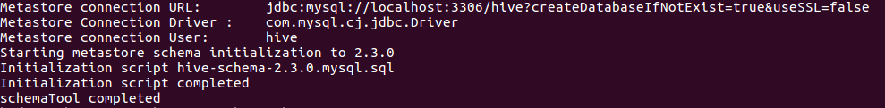
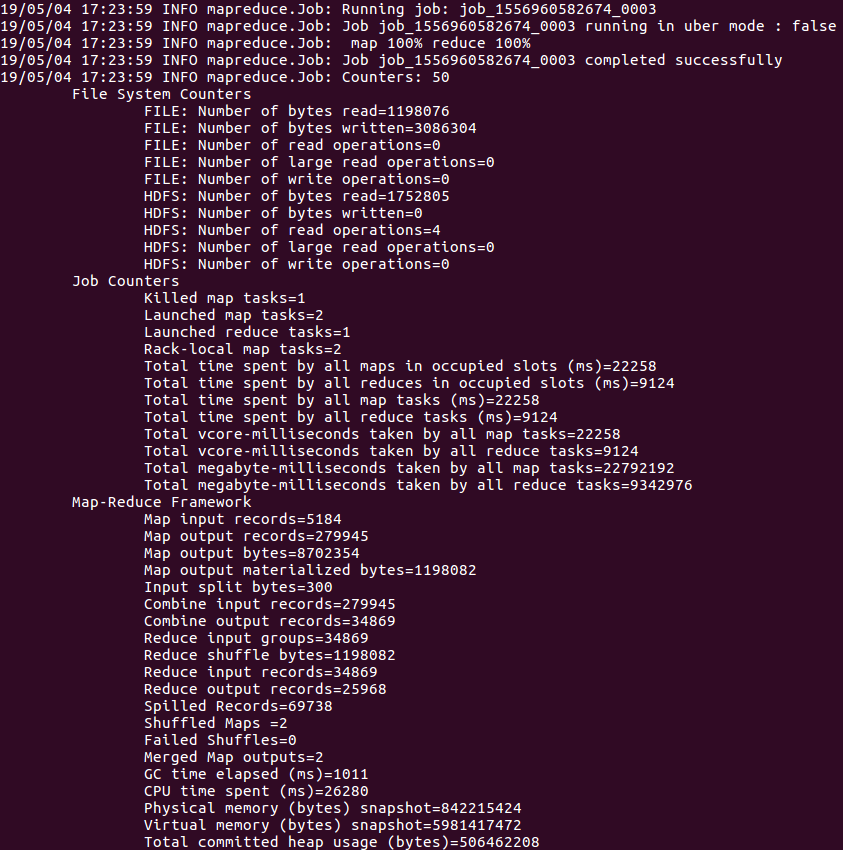
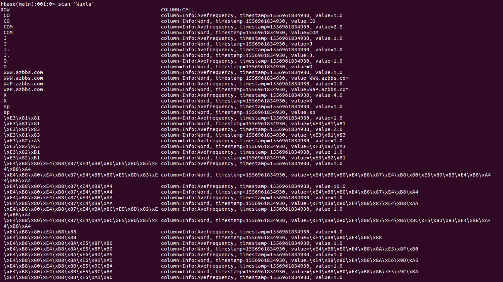

# 大数据处理综合实验课程 Lab4

HBase和Hive的安装与使用

| 姓名   | 学号      | 邮箱                       |
| ------ | --------- | -------------------------- |
| 陈昕元 | 161220018 | 161220018@smail.nju.edu.cn |
| 陈翔   | 161220017 |                            |
| 陈亚栋 | 161220019 | 161220019@smail.nju.edu.cn |

## 1. 实验环境

本次实验使用的软件及其版本如下：

| 软件   | 版本  |
| ------ | ----- |
| HBase  | 1.4.9 |
| Hive   | 2.3.4 |
| Hadoop | 2.9.2 |
| Java   | 1.8   |


## 2. 实验内容与要求

1. 在自己本地电脑上正确安装和运行HBase(推荐1.4.9)和Hive(推荐2.3.4)。

2. 在HBase中创建一张表Wuxia，用于保存下一步的输出结果。

3. 修改第3次实验的MapReduce程序，在Reduce阶段将倒排索引的信息通过文件输出， 而每个词语及其对应的“平均出现次数”信息写入到HBase的表“Wuxia”中。

4. 编写Java程序，遍历上一步中保存在HBase中的表，并把表格的内容(词语以及平 均出现次数)保存到本地文件中。

5. Hive安装完成后，在Hive Shell命令行操作创建表(表名:Wuxia(word STRING, count DOUBLE))、导入平均出现次数的数据、查询(出现次数大于300的词语)和 前100个出现次数最多的词。


## 3. HBase和Hive的安装与使用

### （1）HBase的安装

#### 		1）下载HBase安装包

从Apache网站上(hbase.apache.org)下载HBase稳定发布包: <https://mirrors.cnnic.cn/apache/hbase/1.4.9/>， 我们下载目录下的hbase-1.4.9-bin.tar.gz文件至/usr/hbase目录，使用命令

```shell
tar -zxf hbase-1.4.9-bin.tar.gz
```

解压安装包，这一操作将在/usr/hbase目录下生成hbase-1.4.9文件夹，这即是我们Hbase的安装目录。

#### 		2）设置系统环境变量	

修改系统文件/etc/profile，添加如下内容

```Shell
export HBASE_HOME="/usr/hbase/hbase-1.4.9"
export PATH=$PATH:$HBASE_HOME/bin
```

设置完毕后，使用source /etc/profile命令或重新登录该用户，使环境变量生效。之后，输入命令

```shell
hbase version
```

应可看到如下内容


#### 	3) HBase配置文件设置

此次我们需要实现的仅为单机为分布式HBase配置，因此我们对usr/hbase/habse-1.4.9/conf中的如下文件进行配置：

修改hbase-env.sh文件中的如下内容：

```sh
export JAVA_HOME="/usr/java/jdk1.8.0_201"
export HBASE_CLASSPATH="/usr/hadoop/hadoop-2.9.2/etc/hadoop"
```

修改hbase-site.xml文件，在configuration中添加如下内容：

```xml
<property>
    <name>hbase.rootdir</name>
    <value>hdfs://localhost:9000/hbase</value>
</property>
    
<property>
    <name>hbase.cluster.distributed</name>
    <value>true</value>
</property>
```
因为我们采用的是伪分布模式，这里需要将HBase的数据存储到之前的Hadoop的HDFS上，hbase.rootdir的值便是HDFS上HBase数据存储的位置。值中的主机名和端口号要和之前Hadoop的 core-site.xml中的fs.default.name的值相同。

#### 		4) 启动HBase

在HBase安装目录下，使用命令

```shell
bin/start-hbase.sh
```

即可启动HBase。启动后我们执行Jps指令，可以看到额外启动了HMaster/ HRegionServer / HQuorumPeer进程


### （2）MySQL的安装

在安装Hive之前，我们需要配置好MySQL环境。默认情况下，最新版本的 MySQL 包含在 APT 软件包存储库中。使用如下命令安装MySQL服务器

```shell
sudo apt-get update
sudo apt-get install mysql-server
```

使用如下命令配置MySQL服务器，配置过程不表

```shell
sudo mysql_secure_installation
```

使用如下命令可检查MySQL服务状态

```shell
systemctl status mysql.service
```

使用如下命令安装MySQL客户端

```shell
sudo apt-get install mysql-client
sudo apt-get install libmysqlclient-dev
```

使用如下命令登录MySQL

```shell
mysql -u root -p
```


### （3）Hive的安装

#### 	1) 下载Hive安装包

从Apache网站上下载Hive稳定发布包: https://mirrors.cnnic.cn/apache/hive/hive-2.3.4/。

我们下载其中的apache-hive-2.3.4-bin.tar.gz文件至/usr/hive目录，使用命令

```shell
tar -zxf apache-hive-2.3.4-bin.tar.gz
```

解压安装包为文件夹hive-2.3.4。因此hive的安装路径为/usr/hive/hive-2.3.4

#### 	2) 设置系统环境变量

修改系统文件/etc/profile，添加如下内容

```Shell
export HIVE_HOME="/usr/hive/hbase-2.3.4"
export PATH=$PATH:$HIVE_HOME/bin
```

设置完毕后，使用source /etc/profile命令或重新登录该用户，使环境变量生效。

#### 3) 设置配置文件

进入/usr/hive/hive-2.3.4/conf目录，使用命令

```shell
cp hive-env.sh.template hive-env.sh
```

生成一个hive-env.sh配置文件，并设置其中的HADOOP_HOME，如

```sh
HADOOP_HOME="/usr/hadoop/hadoop-2.9.2"
```

创建一个新文件hive-site.xml，并在文件中加入以下内容（其中，Password一项的值应与你的常用密码设置为相同，避免混淆）

```xml
<configuration>
    <property>
 	    <name>javax.jdo.option.ConnectionURL</name>
   	    <value>jdbc:mysql://localhost:3306/sparksql?createDatabaseIfNotExist=true&amp;useSSL=false</value>
    </property>
   
    <property>
   	    <name>javax.jdo.option.ConnectionDriverName</name>
        <value>com.mysql.cj.jdbc.Driver</value>
    </property>

    <property>
 	    <name>javax.jdo.option.ConnectionUserName</name>
   	    <value>root</value>
    </property>

    <property>
 	    <name>javax.jdo.option.ConnectionPassword</name>
   	    <value>123456</value>
    </property>
</configuration>
```

#### 	4）拷贝MySQL驱动至hive的lib目录

使用（3）中操作顺利安装MySQL后，系统中应有MySQL相关驱动，使用如下指令寻找MySQL驱动文件所在目录

```shell
sudo find / -name mysql-connector*
```

在本机中，MySQL驱动被查找为安装在/usr/share/java/目录下，我们将其拷贝到hive的lib目录下

```shell
cp /usr/share/java/mysql-connector-java-8.0.16.jar /usr/hive/hive-2.3.4/lib
```

#### 5) 启动hive
在首次启动 hive 时:需要初始化模式(init initSchema),我们使用的是mysql数据库,所以初始化的命令是:
```shell
bin/schematool -initSchema -dbType mysql
```
当有如下显示时,说明初始化完成


然后,在hive安装目录下，使用命令

```shell
bin/hive
```

即可启动hive程序。需要注意的是，在启动hive之前，请确保hadoop、hbase、MySQL相关进程已启动。

使用quit指令可退出hive。

## 4. 实验内容

### （1）在HBase中创建表Wuxia

HBase提供了一个基于Ruby语法的命令行Shell，可以通过运行命令hbase shell来进入 Shell:

```shell
./bin/hbase shell
```

进入Shell模式后，通过以下命令建立表Wuxia

```
create 'Wuxia', 'Info'
```

其中‘Info’是列族名，今后我们可在其中添加列‘Word’和‘Avefrequency’表示单词和平均出现次数。

### （2）通过MapReduce程序将每个词语及其对应的“平均出现次数”信息写入到HBase的表“Wuxia”中

我们只需要修改Reduce过程，使其符合HBase的写入方法即可。这其中涉及Reduce类、main函数的改写。

#### 1）Reduce类的改写

在Reduce类的改写任务中，最大的差别在于，我们继承的父类是TableReducer而不是Reducer

Replace:

```Java
public static class Reduce extends Reducer<Text, IntWritable, Text, Text>
```

To:

```Java
public static class Reduce extends TableReducer<Text, IntWritable, ImmutableBytesWritable>
```

从上面的代码中我们可以注意到，Reduce阶段输出的内容发生了改变。由原先的Text修改为ImmutableBytesWritable，因此我们在写入输出内容时也需要做相应的改动

Replace:

```Java
context.write(Key_word, textValue);
```

To:

```Java
Put put = new Put(Bytes.toBytes(curWord));

put.add(Bytes.toBytes("Info"), Bytes.toBytes("Word"), Bytes.toBytes(curWord));
put.add(Bytes.toBytes("Info"), Bytes.toBytes("Avefrequency"), Bytes.toBytes(String.valueOf(average)));

context.write(new ImmutableBytesWritable(Bytes.toBytes(curWord)), put);
```

其中Put类用于写入HBase的列族信息，两条put.add代码表示在列族"Info"下添加列"Word"和"Avefrequency"，列的内容分别为单词和平均出现次数。在写入Reduce过程的输出context.write时，我们写入put的相应列族信息，并将单词本身作为行索引。

#### 2) main函数的改写

首先，我们需要改变job的配置，由原先的默认配置修改为与HBase有关的配置：

Replace:

```Java
Configuration conf = new Configuration();
```

To:

```Java
Configuration conf = HBaseConfiguration.create();
```

其次，我们改变job的Reduce方式，使用TableMapReduceUtil类中的方法，为job设定更新后的Reduce类

Replace:

```Java
job.setReducerClass(mReduce.class);
job.setOutputKeyClass(Text.class);
job.setOutputValueClass(Text.class);
```

To:

```Java
TableMapReduceUtil.initTableReducerJob("Wuxia", hbaseReduce.class, job);
```

其中第一个参数"Wuxia"即是HBase中的表名。

#### (3) 配置文件pom.xml修改

在mvn的配置文件pom.xml中需要添加与HBase有关的配置如下

```xml
<dependency>
    <groupId>org.apache.hbase</groupId>
    <artifactId>hbase-client</artifactId>
    <version>1.4.9</version>
</dependency>
<dependency>
    <groupId>org.apache.hbase</groupId>
    <artifactId>hbase-server</artifactId>
    <version>1.4.9</version>
</dependency>
```

#### (4) 执行结果

在这一步的测试中，仅使用样例中的两个武侠小说文档进行测试，测试结果MapReduce结果如下：



进入hbase的shell模式中，采用scan命令列出'Wuxia'表中的数据，结果截图如下



其中存在类似"\xE3\x81\x81"这样的编码，这种编码表示中文。在HBase的shell模式下，我们不能方便地查看中文字符，但我们仍可对这样的数据进行修改和操作。随着我们接下来的操作，我们可在其他地方看到这些编码对应的中文字符。

## N. 实验中遇到的问题及解决思路

### （1）权限问题

在我们的实验中，执行启动、关闭HBase等敏感操作经常会遇到权限问题，即使我们每次都使用root用户执行命令，也可能遇到难以解决的权限问题。在单机系统下，可暴力地使用如下指令赋予HBase、Hive等文件夹高权限（读、写、执行），如

```shell
chmod -R 777 /usr/hbase
```

### （2）运行MapReduce任务时出现"The auxService:mapreduce_shuffle does not exist"

出现这种情况的原因是在配置文件中没有指定aux-services。解决方案为：在$HADOOP_HOME/etc/hadoop/yarn-site.xml中添加以下内容

```xml
<property>
    <name>yarn.nodemanager.aux-services</name>
    <value>mapreduce_shuffle</value>
</property>
```

### （3）运行MapReduce任务时无法关联HBase中jar包

如果没有在Hadoop配置文件中指定HBase的相关信息，则MapReduce任务无法定位到HBase中的jar包，解决方案是为HADOOP_CLASSPATH添加hbase中jar包的存放路径。在实际操作中，修改$HADOOP_HOME/etc/hadoop/hadoop-env.sh，添加如下内容：

```sh
for f in /usr/hbase/hbase-1.4.9/lib/*.jar; do
  if [ "HADOOP_CLASSPATH" ]; then
    export HADOOP_CLASSPATH=$HADOOP_CLASSPATH:$f
  else
    export HADOOP_CLASSPATH=$f
  fi
done
```

