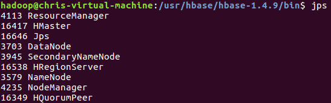

# 大数据处理综合实验课程 Lab4

HBase和Hive的安装与使用

| 姓名   | 学号      | 邮箱                       |
| ------ | --------- | -------------------------- |
| 陈昕元 | 161220018 | 161220018@smail.nju.edu.cn |
| 陈翔   | 161220017 |                            |
| 陈亚栋 | 161220019 | 161220019@smail.nju.edu.cn |

## 1. 实验环境

本次实验使用的软件及其版本如下：

| 软件   | 版本  |
| ------ | ----- |
| HBase  | 1.4.9 |
| Hive   | 2.3.4 |
| Hadoop | 2.9.2 |
| Java   | 1.8   |


## 2. HBase和Hive的安装与使用

### （1）HBase的安装

#### 		1）下载HBase安装包

从Apache网站上(hbase.apache.org)下载HBase稳定发布包: <https://mirrors.cnnic.cn/apache/hbase/1.4.9/>， 我们下载目录下的hbase-1.4.9-bin.tar.gz文件至/usr/hbase目录，使用命令

```shell
tar -zxf hbase-1.4.9-bin.tar.gz
```

解压安装包，这一操作将在/usr/hbase目录下生成hbase-1.4.9文件夹，这即是我们Hbase的安装目录。

#### 		2）设置系统环境变量	

修改系统文件/etc/profile，添加如下内容

```Shell
export HBASE_HOME="/usr/hbase/hbase-1.4.9"
export PATH=$PATH:$HBASE_HOME/bin
```

设置完毕后，使用source /etc/profile命令或重新登录该用户，使环境变量生效。之后，输入命令

```shell
hbase version
```

应可看到如下内容


#### 	3) HBase配置文件设置

此次我们需要实现的仅为单机为分布式HBase配置，因此我们对usr/hbase/habse-1.4.9/conf中的如下文件进行配置：

修改hbase-env.sh文件中的如下内容：

```shell
export JAVA_HOME="/usr/java/jdk1.8.0_201"
export HBASE_CLASSPATH="/usr/hadoop/hadoop-2.9.2/etc/hadoop"
```

修改hbase-site.xml文件，在configuration中添加如下内容：

```shell
<property>
    <name>hbase.rootdir</name>
    <value>hdfs://localhost:9000/hbase</value>
</property>
    
<property>
    <name>hbase.cluster.distributed</name>
    <value>true</value>
</property>
```
因为我们采用的是伪分布模式，这里需要将HBase的数据存储到之前的Hadoop的HDFS上，hbase.rootdir的值便是HDFS上HBase数据存储的位置。值中的主机名和端口号要和之前Hadoop的 core-site.xml中的fs.default.name的值相同。

#### 		4) 启动HBase

在HBase安装目录下，使用命令

```shell
bin/start-hbase.sh
```

即可启动HBase。启动后我们执行Jps指令，可以看到额外启动了HMaster/ HRegionServer / HQuorumPeer进程



### （2）MySQL的安装

在安装Hive之前，我们需要配置好MySQL环境。默认情况下，最新版本的 MySQL 包含在 APT 软件包存储库中。使用如下命令安装MySQL

```shell
sudo apt-get update
sudo apt-get install mysql-server
```

使用如下命令配置MySQL，配置过程不表

```shell
sudo mysql_secure_installation
```

使用如下命令可检查MySQL服务状态

```shell
systemctl status mysql.service
```

### （3）Hive的安装


## N. 实验中遇到的问题及解决思路

### （1）权限问题

在我们的实验中，执行启动、关闭HBase等敏感操作经常会遇到权限问题，即使我们每次都使用root用户执行命令，也可能遇到难以解决的权限问题。在单机系统下，可暴力地使用如下指令赋予HBase、Hive等文件夹高权限（读、写、执行），如

```shell
chmod -R 777 /usr/hbase
```

